# 基于 RGB-D 融合与深度几何验证的协作机器人砖块抓取定位方法（第一版方案稿）

> 作者备注：本文是第一版中文论文初稿，用于确定选题、创新点、结构和实验设计。文中的“预实验结果”来自当前项目已有记录，可作为系统可行性证据；正式投稿前必须补充更大规模真实实验，并将所有“待测”和“待分类”内容替换为真实统计结果。
>
> 当前阶段说明：本文为第一版论文方案稿，主要用于评估选题价值、技术路线、创新点组织和后续实验设计。当前系统已完成真实 RGB-D 采集、协作机器人执行、二次定位记录和离线复盘流程，已有结果仅作为系统可行性预实验，不作为最终性能结论。后续将补充大样本真实抓取实验，并完成 RGB-only、Depth-only、RGB-D legacy、Ours 和 Ours + secondary 等方法对比。

## 摘要

针对协作机器人砖块抓取与二次对位过程中纯 RGB 分割易受光照、弱纹理、遮挡和边界漂移影响的问题，本文设计一种 RGB-D 候选融合与深度几何验证方法。该方法分别生成 RGB 语义候选和深度空间候选，利用工作平面高度图、连通域分割和矩形拟合提取深度候选，并从尺寸匹配、矩形度、平面性、完整性、高度一致性和边界接触惩罚等方面评价候选可靠性。在融合阶段，系统采用中心距离、角度差、掩膜重叠度和深度差进行跨模态一致性检查；当深度候选满足可信度条件时优先采用深度几何结果，当深度缺失或不可信时回退到 RGB 语义候选。基于 JAKA 协作机器人与 Mech-Eye 3D 相机的预实验表明，系统已完成真实 RGB-D 数据采集、主抓取、二次定位、过程记录和离线复盘链路；最新一轮离线复盘覆盖 7 组抓取流程、14 条阶段记录，可用于后续失败分析和大样本对比实验。本文当前结果仅作为系统可行性证据，后续正式实验将进一步评估该方法在平面定位误差、角度误差、抓取成功率、二次定位成功率和处理时间等指标上的表现。

**关键词：** 协作机器人；RGB-D 视觉；深度几何；实例分割；抓取定位；离线复盘

## 1 引言

协作机器人在搬运、装配、分拣和建筑材料转运等场景中逐渐承担重复性高、定位精度要求明确的操作任务。与结构化工装环境相比，实际工作站中的物体位置、姿态、光照和背景往往存在变化，机器人需要依靠视觉系统实时估计目标位置和姿态。对于规则砖块类目标，传统方案通常基于 RGB 图像检测或实例分割获得目标区域，再结合相机标定结果将图像坐标转换为机器人坐标。然而，纯 RGB 方法在现场应用中存在明显局限：当砖块颜色接近背景、表面纹理较弱、局部遮挡或光照不均时，分割掩膜可能发生偏移；当多个砖块相邻或堆叠时，仅根据二维图像难以判断真实抓取对象的空间层次；当识别结果用于机械臂执行时，像素级偏差会进一步放大为抓取点或姿态角误差。

RGB-D 相机同时提供彩色图像和深度信息，为工业视觉抓取提供了更多空间约束。已有研究表明，深度图或点云能够用于估计抓取矩形、表面法向和物体空间位置，从而提高机器人抓取在复杂场景中的鲁棒性 [1-3]。不过，面向实验室或工业工作站的实际系统并不总是需要复杂端到端网络。对于形状规则、尺寸先验明确的砖块，深度图中的高度差、平面性、矩形度和区域完整性本身就是强约束。将 RGB 实例分割的语义定位能力与深度几何约束结合起来，可以在不重新训练大型端到端网络的条件下提高候选选择的可靠性。

本文围绕协作机器人砖块抓取工作站，提出一种 RGB-D 融合与深度几何验证方法。与直接将 RGB 和深度输入端到端网络不同，本文采用模块化工程路线：RGB 分割负责提供语义候选，深度几何负责提供空间可信度验证，融合决策模块负责选择最终抓取候选。当深度几何候选满足可信度条件时，系统优先采用深度结果；当深度数据缺失或深度候选不满足条件时，系统回退到 RGB 分割结果。这里的可解释性主要体现在候选得分由尺寸、平面性、完整性等子指标组成；工程可部署性主要体现在方法可嵌入现有工作站软件流程；可复盘性则依赖 RGB-D 数据、候选结果、机器人位姿和事件日志的同步保存。需要说明的是，本文当前处于预实验验证阶段，已有结果主要用于证明系统链路已打通和实验方案可执行，不作为最终性能结论。

本文主要贡献如下：

1. 建立了面向规则砖块抓取的 RGB 语义候选与深度空间候选统一表示，将原有纯 RGB 识别流程扩展为 RGB-D 候选融合流程。
2. 设计了基于工作平面高度图和几何先验约束的深度候选生成方法，利用尺寸匹配、矩形度、平面性、完整性和高度一致性评价候选可靠性。
3. 实现了可信深度优先、异常深度条件下 RGB 语义回退的候选决策机制，在深度候选可信时优先采用深度几何结果，在深度异常时保留 RGB 识别能力。
4. 搭建了协作机器人真实实验闭环，包括 RGB-D 采集、机器人执行、二次定位、过程记录和离线复盘，为后续系统实验和失败分析提供基础。

## 2 相关工作

### 2.1 基于 RGB 的目标检测与实例分割

基于 RGB 图像的目标检测和分割方法具有部署简单、推理速度快和数据采集成本低等优点，在机器人目标识别中应用广泛。Mask R-CNN 通过区域候选网络和掩膜分支实现实例级目标分割，为后续目标轮廓、中心和姿态估计提供了基础 [4]。YOLO 系列模型进一步强化了实时检测能力，工程实现中常用于检测、分割和姿态估计等实时视觉任务 [5]。对于砖块抓取任务，RGB 实例分割可以直接输出目标掩膜，并通过掩膜质心、最小外接矩形或主成分分析估计抓取中心与角度。

然而，RGB 方法主要依赖纹理、颜色和二维边界特征。当背景与目标颜色接近、光照变化明显或物体表面纹理不足时，分割结果可能出现漏检、误检或边界偏移。此外，二维图像无法直接表达目标相对相机的深度层次，因此在多目标接触、堆叠或局部遮挡场景中，仅依靠 RGB 结果选择抓取对象存在不确定性。

### 2.2 RGB-D 机器人抓取

RGB-D 视觉为机器人抓取提供了深度、形状和空间位姿信息。Lenz 等较早将深度学习用于机器人抓取矩形检测，通过 RGB-D 图像估计可执行抓取位姿 [1]。Dex-Net 2.0 利用大规模合成深度图和解析抓取指标训练抓取质量网络，证明了深度图在鲁棒抓取规划中的价值 [2]。Morrison 等提出 GG-CNN，从深度图中实时生成像素级抓取质量、角度和宽度图，实现闭环抓取控制 [3]。除深度图上的平面抓取矩形检测外，点云抓取位姿检测也被广泛研究，例如 GPD 可从点云中生成六自由度抓取候选 [7]；PCL 等点云工具库则为滤波、分割和几何估计提供了基础支持 [8]。这些方法说明，深度信息不仅可以补充 RGB 语义，还可以直接用于抓取质量估计、空间位姿推断和机器人运动控制。

近年来，一些研究进一步探索 RGB 与深度的跨模态融合，通过特征融合、注意力机制或深度引导网络提升抓取检测性能 [6]。这类方法通常具有较强表达能力，但也对训练数据、模型结构和部署环境提出更高要求。对于本文关注的规则砖块抓取场景，目标几何尺寸相对固定，工作区域相对可控，因此可以采用更轻量、可解释的深度几何验证策略，而不必完全依赖复杂端到端网络。

### 2.3 工业工作站中的可追溯实验闭环

机器人视觉系统从算法验证走向实际应用时，仅报告单张图片上的识别效果通常不足以支撑工程可靠性。系统需要记录输入图像、深度图、候选结果、机械臂状态、执行命令和失败原因，并通过离线复盘分析算法在不同阶段的表现。对于协作机器人工作站而言，可追溯数据记录可以帮助定位误抓、漏抓、角度偏差和二次定位失败等问题，也便于后续开展消融实验和参数优化。本文在算法模块之外，强调过程记录与离线复盘，是为了将视觉识别从“能识别”推进到“可验证、可分析、可复现”。

## 3 系统平台与问题定义

### 3.1 系统平台

本文系统由协作机器人、RGB-D 工业相机、上位机软件、视觉识别模块和流程控制模块组成。RGB-D 相机采集工作区域的彩色图像和深度图；上位机调用实例分割模型和深度几何模块生成抓取候选；标定模块将图像坐标转换为机器人坐标；协作机器人根据抓取点、抓取深度和末端旋转角执行抓取、二次定位和放置动作。系统同时保存运行过程中的 RGB 图像、深度图、候选结果、机器人 TCP 位姿、关节角、流程节点和事件日志。

图 1 给出了系统总体流程。彩色图像进入 RGB 实例分割分支，深度图进入深度几何分支；两个分支分别输出候选区域后由融合决策模块选择最终抓取候选；机器人执行抓取后进入二次定位阶段；所有阶段数据被写入案例目录，并可通过离线复盘脚本重新分析。图中实线表示在线识别与执行数据流，虚线表示过程记录、离线复盘和参数优化链路。

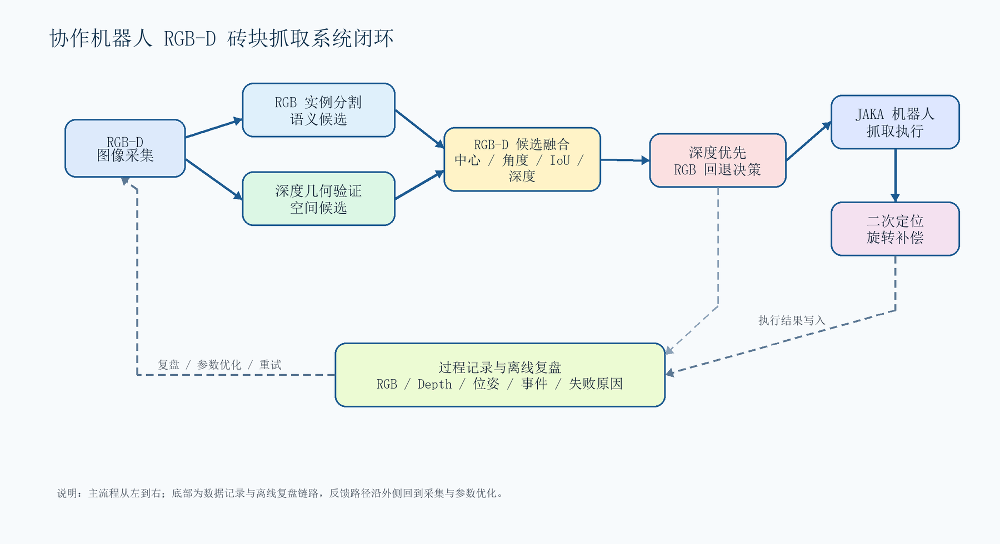

**图 1  协作机器人 RGB-D 砖块抓取系统闭环示意图（实线为在线执行数据流，虚线为记录与离线复盘链路）。**

图 2 给出了实验硬件平台与工作空间关系。JAKA 协作机器人安装在直线导轨工作站上，Mech-Eye RGB-D 相机覆盖主抓取区域并采集砖块 RGB-D 数据，末端执行器根据视觉输出完成抓取与转运，二次定位区域用于抓取后的姿态复核与旋转补偿。

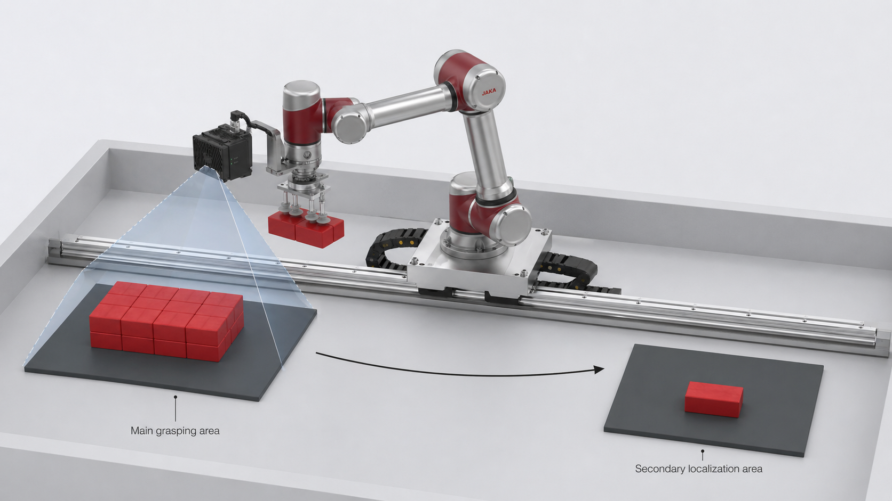

**图 2  协作机器人 RGB-D 砖块抓取硬件平台与工作空间示意图。**

### 3.2 问题定义

给定一帧彩色图像 \(I_{rgb} \in \mathbb{R}^{H \times W \times 3}\) 和对应深度图 \(D \in \mathbb{R}^{H \times W}\)，系统需要输出如式 (3-1) 所示的机器人可执行抓取位姿：

\[
g = (x_r, y_r, z_r, \theta_r), \tag{3-1}
\]

其中 \(x_r, y_r, z_r\) 表示机器人坐标系下的抓取位置，\(\theta_r\) 表示末端执行器绕工具坐标系的补偿旋转角。由于本文任务为固定末端姿态下的规则砖块平面抓取，本文重点估计平面位置、抓取高度和绕工具轴的旋转角，而不讨论通用六自由度姿态估计。图像域候选定义如式 (3-2) 所示：

\[
c = (u, v, z, \theta, s, M), \tag{3-2}
\]

其中 \(u, v\) 为像素中心，\(z\) 为深度值，\(\theta\) 为图像域主方向角，\(s\) 为候选评分，\(M\) 为候选掩膜。需要注意的是，RGB 候选中的 \(s\) 通常表示实例分割置信度，深度候选中的 \(s\) 表示几何评分，两者不被直接视为同一概率量。本文目标是在 RGB 候选与深度候选之间选择更可靠的候选，并将其转换为机器人抓取位姿。

### 3.3 原系统局限与本文改进内容

原有系统主要依赖 RGB 图像上的目标分割结果确定砖块中心、角度和抓取深度，深度信息更多用于辅助显示或简单深度读取。在实际工作站中，这种流程容易受到分割边界漂移、局部遮挡、深度缺失和二次定位角度误差的影响。本文在原有视觉识别流程上增加深度几何约束、跨模态一致性验证和可追溯实验记录，使系统从“单模态识别”转向“语义候选 + 空间几何验证”的融合定位。

**表 1  原 RGB 流程与本文 RGB-D 改进模块对照**

| 原有流程或问题 | 本文修改内容 | 采用理论或方法 | 需要验证的效果 |
| --- | --- | --- | --- |
| 主要依赖 RGB 分割掩膜确定候选 | 增加深度几何候选分支 | 工作平面高度建模、连通域分割、最小外接矩形拟合 | 降低弱纹理、光照变化和边界漂移造成的定位偏差 |
| RGB 候选缺少三维几何可信度判断 | 引入多因子几何评分 | 尺寸先验、平面性约束、矩形度约束、区域完整性约束 | 判断候选是否符合规则砖块空间形态 |
| RGB 与深度结果缺少一致性检查 | 增加跨模态候选匹配 | 中心距离、角度差、Mask IoU、深度差硬阈值约束 | 识别 RGB 与深度候选是否对应同一目标 |
| 深度异常时容易直接失败 | 保留 RGB 语义回退路径 | 基于可信度门限的容错决策机制 | 提升深度缺失或噪声场景下的流程连续性 |
| 抓取后角度误差难以修正 | 增加二次定位与旋转补偿 | 姿态再估计、180 度对称角归一化、最短旋转补偿 | 减小放置阶段姿态偏差 |
| 失败原因难以追溯 | 保存 RGB、Depth、候选、位姿和事件日志 | 可追溯实验记录、离线一致性复盘和失败分类 | 支撑后续失败分类、消融实验和参数优化 |

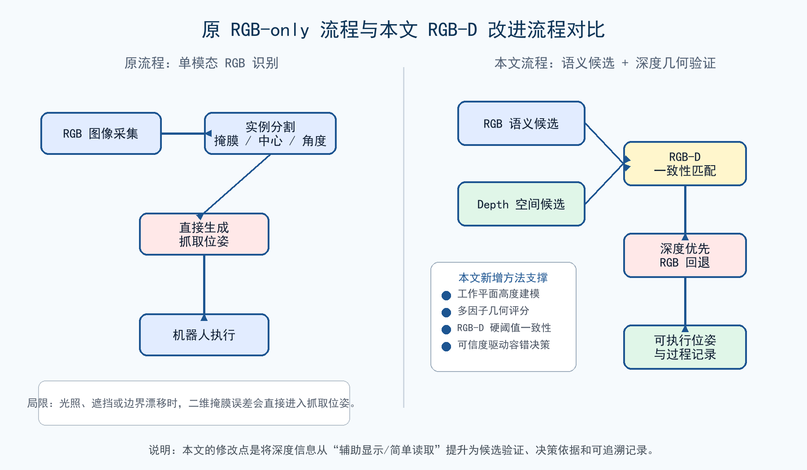

**图 3  原 RGB-only 识别流程与本文 RGB-D 几何验证流程对比图。**

## 4 基于深度几何先验的 RGB-D 候选融合方法

图 4 给出了 RGB-D 融合与深度优先决策流程。本文将 RGB 分支输出记为语义候选集合 \(C_r\)，将深度几何分支输出记为空间候选集合 \(C_d\)。图中 \(I_{rgb}\) 表示彩色图像，\(I_d\) 与本文记号 \(D\) 均表示深度图。RGB 分支负责回答“图像中哪一块区域可能是砖块”，深度分支负责回答“该区域是否符合规则砖块的三维几何先验”。融合模块在两个候选集合之间进行一致性匹配，并依据深度几何可信度输出最终抓取位姿。

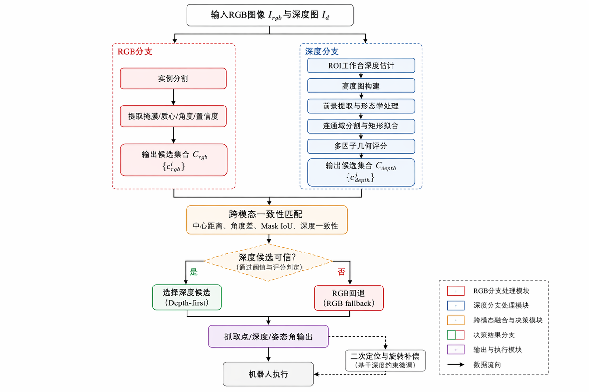

**图 4  RGB-D 融合与深度优先决策流程。**

### 4.1 方法总体建模

本文方法采用“语义提议、几何验证、可信度决策”的模块化路线。对于每一帧 RGB-D 数据，系统先分别生成 \(C_r=\{c_r^1,c_r^2,\ldots,c_r^m\}\) 和 \(C_d=\{c_d^1,c_d^2,\ldots,c_d^n\}\)。其中，RGB 候选主要包含类别置信度、实例掩膜、图像质心和主方向角；深度候选主要包含高度图前景区域、矩形拟合结果、深度统计量和几何评分。最终抓取候选不直接取 RGB 或 Depth 的最高分结果，而是在候选有效性和跨模态一致性基础上进行选择。

这种建模方式的依据在于规则砖块具有稳定的几何先验：平面区域应具有较低的高度离散度，外接矩形应与已知砖块尺寸接近，候选区域应具备较高的矩形度和完整性，并且不应大量接触 ROI 边界。与端到端深度网络相比，该路线计算量较小，子评分含义明确，也更适合样本量有限但目标形态明确的工业工作站场景。

### 4.2 基于实例掩膜的 RGB 语义候选生成

RGB 分支使用实例分割模型对彩色图像进行砖块目标识别。模型输出边界框、类别置信度和实例掩膜。对于每一个 RGB 候选区域，系统首先按照式 (4-1) 计算掩膜质心作为候选中心：

\[
u = \frac{1}{|M|}\sum_{(i,j)\in M} j,\quad
v = \frac{1}{|M|}\sum_{(i,j)\in M} i. \tag{4-1}
\]

随后在掩膜区域内提取有效深度像素，并通过异常值过滤获得候选深度统计量。为避免无效深度、飞点或边缘噪声影响，系统去除小于最小有效深度、非有限值和分位数外的异常值，并计算有效深度比例。当有效深度像素数量和比例满足阈值时，候选被标记为深度有效。候选方向角通过掩膜主成分分析或外接矩形方向获得。

RGB 分支的优势在于能够识别语义目标并区分砖块与背景；不足在于当掩膜边界偏移时，候选中心和角度会随之偏移。因此，RGB 候选更适合作为语义提议，而不是唯一决策依据。

### 4.3 基于高度图与几何先验的深度候选生成

深度分支直接从深度图中提取砖块几何候选。首先在设定的 ROI 内估计工作台基准平面或基准深度。当前实现采用有效深度直方图主峰估计工作台深度，用于降低少量砖块前景点、无效深度点和飞点对基准深度估计的影响。随后按照式 (4-2) 构建局部高度图：

\[
H(u,v)=D_b-D(u,v), \tag{4-2}
\]

其中 \(D_b\) 表示工作台或背景平面的估计深度，\(D(u,v)\) 表示当前像素深度。在相机俯视工作台且深度值沿视线方向增大的条件下，砖块比工作台更靠近相机，因此 \(D(u,v)\) 较小，\(H(u,v)\) 表现为正的局部凸起。系统根据最小高度阈值和有效深度掩膜提取前景区域，并通过形态学开闭运算降低噪声影响。

随后，系统对前景掩膜进行连通域分割，并对每个区域拟合最小外接矩形。对于每个深度候选，系统计算区域面积、矩形长宽、矩形度、完整性、平面性、高度一致性和边界接触状态等几何特征。设候选长边、短边和中位高度分别为 \(l,w,h_m\)，砖块先验长边、短边和高度分别为 \(l_0,w_0,h_0\)，容许误差分别为 \(\tau_l,\tau_w,\tau_h\)，候选高度标准差为 \(\sigma_h\)，平面性阈值为 \(\tau_\sigma\)。\(\operatorname{clip}(x,0,1)\) 表示将 \(x\) 截断到 \([0,1]\) 区间。各子评分定义如式 (4-3) 所示：

\[
\begin{aligned}
S_{size} &= \frac{1}{2}\left[\max\left(0,1-\frac{|l-l_0|}{\tau_l}\right)+\max\left(0,1-\frac{|w-w_0|}{\tau_w}\right)\right],\\
S_{plane} &= \operatorname{clip}\left(1-\frac{\sigma_h}{\tau_\sigma},0,1\right),\\
S_{height} &= \operatorname{clip}\left(1-\frac{|h_m-h_0|}{\tau_h},0,1\right),\\
S_{rect} &= \operatorname{clip}\left(\frac{A_{hull}}{A_{rect}},0,1\right),\\
S_{comp} &= \operatorname{clip}\left(\frac{A_{region}}{A_{hull}},0,1\right).
\end{aligned} \tag{4-3}
\]

其中 \(A_{rect}\) 为拟合矩形面积，\(A_{hull}\) 为候选区域凸包面积，\(A_{region}\) 为候选前景像素面积。\(S_{size}\) 表示尺寸匹配得分，\(S_{plane}\) 表示局部平面性得分，\(S_{height}\) 表示高度一致性得分，\(S_{rect}\) 表示矩形度得分，\(S_{comp}\) 表示区域完整性得分。上述指标分别对应规则砖块的尺寸先验、平面先验、厚度先验和轮廓先验。

综合几何评分如式 (4-4) 所示：

\[
S_g=\operatorname{clip}\left(0.35S_{size}+0.20S_{rect}+0.20S_{plane}+0.15S_{comp}+0.10S_{height}-0.20I_{border},0,1\right). \tag{4-4}
\]

其中 \(I_{border}\in\{0,1\}\) 为边界接触指示变量：当候选区域接触 ROI 或图像边界时取 1，否则取 0。式 (4-4) 与当前代码实现保持一致，即边界接触候选在综合评分中扣除 0.20，并将最终评分限制在 \([0,1]\)。当前权重为工程经验值，用于突出尺寸匹配、矩形轮廓和平面性对规则砖块识别的重要性；本文现阶段不将其作为最优参数结论，后续将通过参数敏感性实验进一步优化。最终按候选有效性、边界接触状态、几何评分和深度优先级对深度候选排序，获得深度候选列表。

图 5 展示了深度几何处理过程，包括原始深度图、高度图可视化、前景提取与形态学处理，以及矩形拟合和深度候选输出。该过程对应当前代码中的工作台深度估计、高度图构建、前景区域提取、连通域分割、矩形拟合和候选评分步骤。

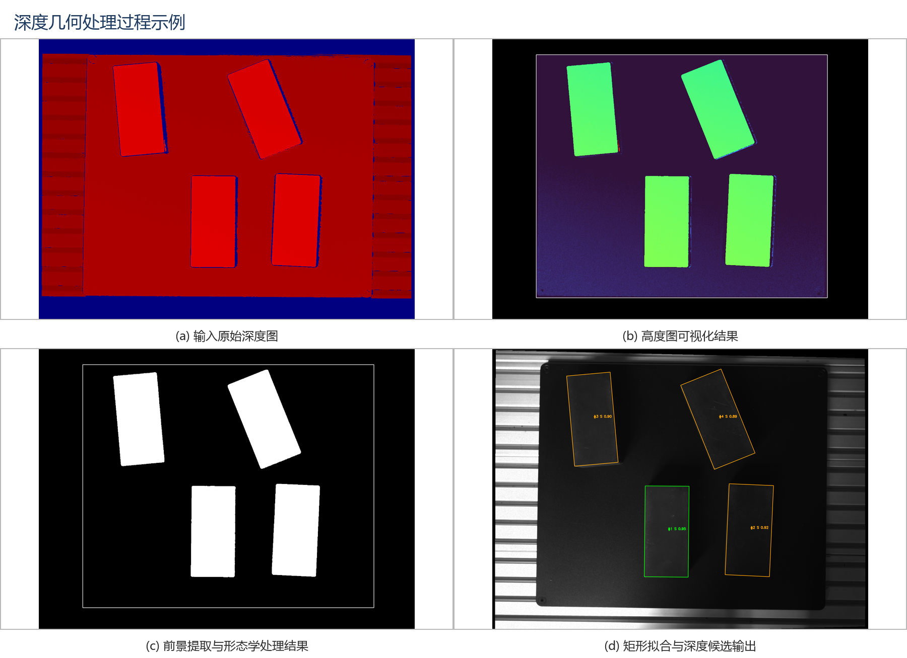

**图 5  深度几何处理过程示例：(a) 输入原始深度图；(b) 高度图可视化结果；(c) 前景提取与形态学处理结果；(d) 矩形拟合与深度候选输出。**

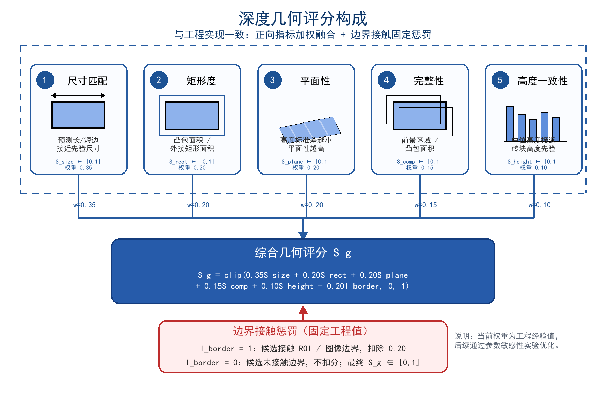

**图 6  深度几何评分构成示意图：尺寸匹配、矩形度、平面性、完整性和高度一致性作为正向指标加权融合，边界接触指示变量作为固定惩罚项共同决定候选几何可信度。**

与 RGB 分支相比，深度几何分支不依赖颜色和纹理，能够更直接地反映砖块在三维空间中的突出区域和几何形状。其不足是当深度图缺失、反光、噪声较大或 ROI 参数不合适时，可能出现深度前景断裂或误分割。

### 4.4 跨模态候选一致性匹配

为了判断 RGB 候选与深度候选是否对应同一块砖，本文从中心距离、角度差、掩膜重叠和深度差四个方面进行一致性匹配。设 RGB 候选为 \(c_r\)，深度候选为 \(c_d\)，当二者满足式 (4-5) 至式 (4-8) 的条件时认为匹配成功：

\[
\|p_r-p_d\|_2 \le \tau_p, \tag{4-5}
\]

\[
\Delta \theta(c_r,c_d) \le \tau_\theta, \tag{4-6}
\]

\[
IoU(M_r,M_d) \ge \tau_{iou}, \tag{4-7}
\]

\[
|z_r-z_d| \le \tau_z. \tag{4-8}
\]

其中 \(p_r,p_d\) 为两个候选的像素中心，\(\tau_p,\tau_\theta,\tau_{iou},\tau_z\) 分别为中心距离、角度、重叠度和深度差阈值。当前实现采用硬阈值筛选：只有中心距离、角度差、深度差和 Mask IoU 同时满足阈值时，RGB 候选与深度候选才被认为匹配；若多个深度候选同时满足条件，则进一步按 Mask IoU、边界框 IoU、中心距离、角度差、深度差和几何评分排序。实际运行时，并非每一项在所有场景中都可用。例如，当 RGB 候选有效但深度候选缺失时，系统仍允许 RGB 回退；当 RGB 候选质量较低但深度候选几何评分较高时，系统可以选择深度候选作为主抓取目标。

### 4.5 可信度驱动的深度优先与 RGB 回退决策

本文采用深度优先、RGB 回退的决策策略。其基本思想是：对于规则砖块目标，可信的深度几何结果通常比单纯 RGB 掩膜更能反映实际空间位置；但深度图也可能因采集噪声或局部缺失而不可用，因此系统必须保留 RGB 识别能力。

融合决策规则如下：

1. 若深度候选存在且几何评分、尺寸、区域完整性等指标满足阈值，则优先选择深度候选。
2. 若深度候选与 RGB 候选匹配，则记录 RGB-D 一致性信息，用于提高结果可解释性。
3. 若深度候选可信但与 RGB 候选不一致，则选择深度候选，同时记录 RGB 与深度不一致警告，供离线复盘检查。
4. 若深度候选缺失或不可信，而 RGB 候选有效，则回退到 RGB 候选。
5. 若二者均无有效候选，则输出无抓取结果，并触发流程重试或人工复核。

该策略避免了“RGB 结果始终优先”带来的误抓风险，也避免了“深度结果缺失时系统完全失败”的问题。对于工程应用而言，这种可解释的决策路径便于调试和参数优化。

### 4.6 二次定位与末端姿态旋转补偿

在初次抓取后，系统将砖块放置到二次定位区域，并再次采集 RGB-D 数据进行对位识别。二次定位阶段同样优先使用深度几何候选，并可在识别到目标角度后执行末端旋转补偿。图 4 中的“基于深度约束微调”是指二次定位阶段仍使用深度候选的有效性、几何评分和边界接触状态约束最终角度更新，而不是只根据 RGB 掩膜角度直接旋转。规则砖块的长轴姿态具有 180 度等效性，因此系统在等效角度集合中选择绝对值最小的旋转增量，以避免末端角度发生不必要的大幅翻转。设二次定位识别角为 \(\theta_{sec}\)，上一阶段参考角为 \(\theta_{prev}\)，最短旋转增量定义如式 (4-9) 所示：

\[
\Theta=\{\theta_{sec}-\theta_{prev}+k\cdot180^\circ \mid k\in\mathbb{Z}\},\quad
\Delta\theta^{*} = \arg\min_{\delta\in\Theta} |\delta|. \tag{4-9}
\]

当二次定位识别失败时，系统不会直接继续下降抓取，而是记录失败事件并回到主抓取流程重新识别。这种失败重试机制能够降低二次定位误差向后续放置动作传播的风险。

### 4.7 坐标转换与机器人可执行位姿生成

候选融合模块输出的是图像域候选 \(c=(u,v,z,\theta,s,M)\)，机器人执行模块需要的是机器人基坐标系下的抓取位姿 \(g=(x_r,y_r,z_r,\theta_r)\)。设相机内参矩阵为 \(K\)，像素点对应深度为 \(z\)，则像素坐标到相机坐标的反投影可表示为式 (4-10)：

\[
{}^C P=zK^{-1}[u,v,1]^T. \tag{4-10}
\]

设相机坐标系到机器人基坐标系的手眼标定变换矩阵为 \({}^B T_C\)，其中左上标表示目标坐标系，右下标表示源坐标系，则机器人基坐标系下的空间点可由式 (4-11) 得到：

\[
\begin{bmatrix}{}^B P\\1\end{bmatrix}={}^B T_C\begin{bmatrix}{}^C P\\1\end{bmatrix}. \tag{4-11}
\]

若显式考虑末端、相机、目标局部坐标系和抓取偏置，完整位姿链可写为式 (4-12)：

\[
{}^B T_G={}^B T_E\,{}^E T_C\,{}^C T_O\,{}^O T_G. \tag{4-12}
\]

其中 \({}^B T_E\) 为机器人基坐标系到末端坐标系的正运动学变换，\({}^E T_C\) 为手眼标定结果，\({}^C T_O\) 由视觉识别得到，\({}^O T_G\) 表示目标局部坐标系到抓取点的偏置。实际执行时，末端执行器旋转角由图像主方向角、标定角度偏置和二次定位补偿共同确定，如式 (4-13) 所示：

\[
\theta_r=\operatorname{norm}\left(\theta+\theta_{cal}+\Delta\theta^{*}\right). \tag{4-13}
\]

其中 \(\theta_{cal}\) 表示相机图像方向与机器人末端工具方向之间的标定偏置，\(\operatorname{norm}(\cdot)\) 表示将角度归一化到机器人末端允许的旋转范围。通过上述转换，视觉模块输出的二维候选中心、深度和主方向角可以生成机器人可执行的三维抓取位姿。

图 7 给出了相机、机器人和目标之间的坐标系关系。该图对应式 (4-10) 至式 (4-13)：图像像素和深度首先经相机内参反投影到相机坐标系，再通过手眼标定和机器人正运动学转换到机器人基坐标系，最后结合目标局部抓取偏置生成抓取坐标系下的可执行位姿。

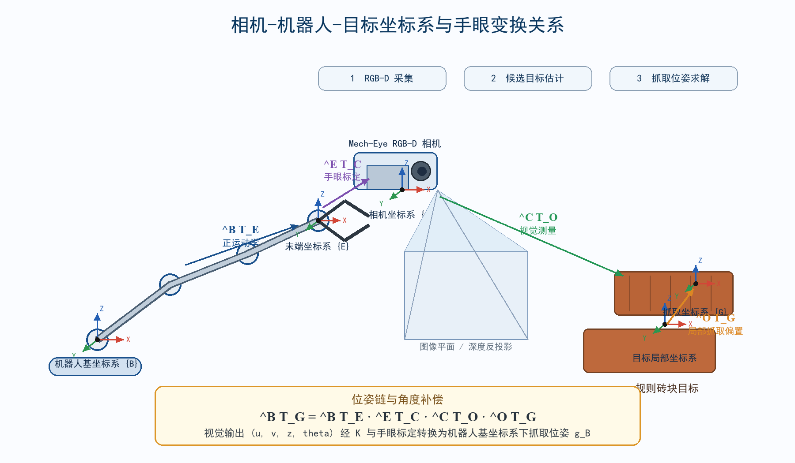

**图 7  相机-机器人-目标坐标系与手眼变换关系示意图。**

图 8 从软件识别与决策层、硬件采集与执行层两个层次描述系统运行过程。上层完成 RGB-D 采集标定、RGB 实例分割、深度几何候选生成、RGB-D 一致性匹配、深度优先/RGB 回退决策、位姿转换和过程记录；下层完成相机采集、上位机视觉处理、JAKA 控制器通信、末端执行器动作和主抓取/二次定位执行。

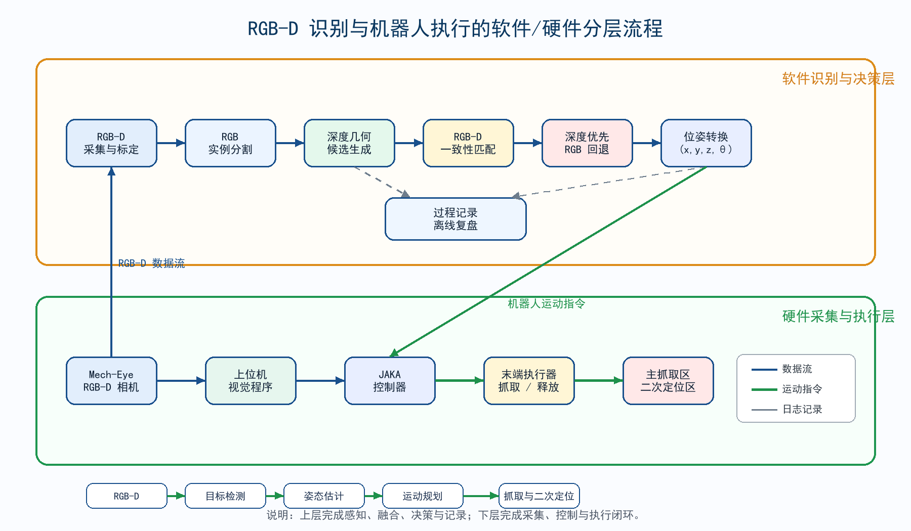

**图 8  RGB-D 识别与机器人执行的软件/硬件分层流程。**

## 5 实验设计与当前进展

### 5.1 实验目的与改进验证逻辑

本文实验设计围绕“修改内容是否有效”展开，而不是仅给出单一抓取成功率。具体而言，需要分别验证深度几何分支是否能改善纯 RGB 定位的不稳定性，跨模态一致性匹配是否能减少候选选择错误，深度优先与 RGB 回退机制是否能提高异常场景下的流程连续性，以及二次定位是否能降低最终放置阶段的姿态偏差。

**表 2  本文改进模块与验证方案设计**

| 改进模块 | 对应方法 | 验证方式 | 主要评价指标 |
| --- | --- | --- | --- |
| 深度几何候选生成 | 高度图、前景提取、矩形拟合、几何评分 | RGB-only 与 Ours 对比 | 平面定位误差、角度误差、误检率 |
| 多因子几何评分 | 尺寸匹配、矩形度、平面性、完整性、高度一致性 | 完整方法与无深度几何消融对比 | 候选有效率、候选排序正确率 |
| RGB-D 候选一致性匹配 | 中心距离、角度差、IoU、深度差 | 完整方法与无 RGB-D 匹配对比 | 多候选场景误选率 |
| 深度优先与 RGB 回退 | 可信度驱动决策、异常深度容错 | Ours 与无 RGB 回退对比 | 流程成功率、候选缺失率 |
| 二次定位与旋转补偿 | 姿态再估计、最短旋转补偿 | Ours 与 Ours + secondary 对比 | 二次定位成功率、放置角度误差 |
| 离线复盘与过程记录 | RGB-D 数据记录、运行态一致性检查 | 预实验复盘与失败案例统计 | 失败类型、复盘一致性、可追溯性 |

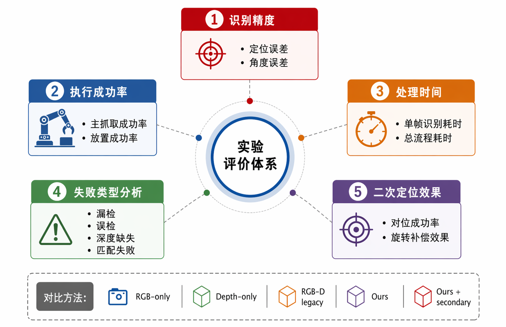

**图 9  实验评价体系示意图：从识别精度、执行成功率、处理时间、失败类型和二次定位效果五个方面验证本文改进，并设置 RGB-only、Depth-only、RGB-D legacy、Ours 和 Ours + secondary 作为后续对比方法。**

### 5.2 当前已完成工作

实验平台由 JAKA 协作机器人、Mech-Eye RGB-D 工业相机、上位机软件和砖块抓取工作站组成。上位机运行 Python 程序，集成 PyQt5 界面、ONNX 推理、深度图处理、机器人通信、流程控制和数据记录模块。视觉模型部署为 ONNX 格式，深度几何模块直接处理相机输出深度图。机器人通过网络接口接收抓取和移动指令。

当前已完成的工作包括：

1. 真实 JAKA 协作机器人与 Mech-Eye RGB-D 平台已接入。
2. RGB-D 图像采集流程已打通，能够保存 RGB 图像、深度图和显示结果。
3. 主抓取与二次定位阶段均可保存过程记录，包括候选信息、机器人位姿、流程节点和事件日志。
4. 已完成 7 组完整抓取-二次定位闭环流程预实验。
5. 已实现离线复盘脚本，可输出分析图、summary 和待复核案例。

最新离线复盘已覆盖 7 个砖块处理案例、14 条阶段记录。由于每组闭环流程包含主抓取和二次定位两个阶段，因此 7 组流程对应 14 条阶段记录。复盘状态包括运行结果一致（runtime_consistent）、需人工复核（review_needed）和离线结果缺失（offline_missing）。该结果仅说明系统已具备多阶段数据保存、运行态结果复核和失败案例定位能力，不作为最终识别性能或抓取成功率结论。

图 10 和图 11 给出了当前已有记录中的真实案例。图 10 对应主抓取阶段，展示 RGB 分割结果与深度几何候选分析；图 11 对应二次定位阶段，展示二次定位 RGB 识别和深度候选输出。这些图用于说明数据记录和离线复盘链路已经形成，不作为最终性能对比结果。

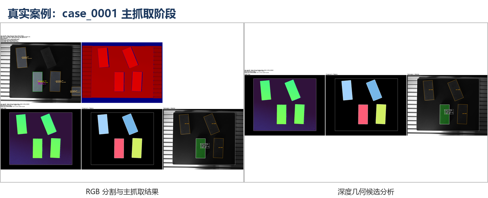

**图 10  真实案例 case_0001 主抓取阶段识别与深度分析结果。图中小字为离线复盘原始界面输出，当前用于说明记录链路完整；正式稿建议拆分为 RGB 识别结果与深度候选结果两张高分辨率子图。**

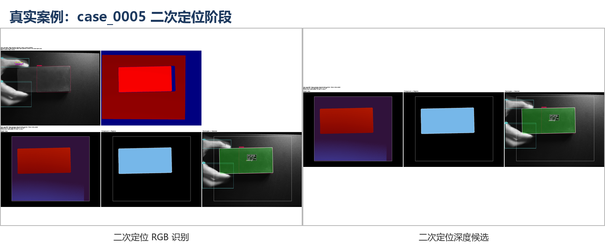

**图 11  真实案例 case_0005 二次定位阶段识别结果。图中小字为离线复盘原始界面输出，当前用于说明二次定位记录内容；正式稿建议拆分为二次定位 RGB 识别与深度候选输出两张高分辨率子图。**

**表 3  预实验离线复盘结果统计（预实验共完成 7 组完整抓取-二次定位闭环流程）**

| 项目 | 数值 |
| --- | ---: |
| 流程案例数 | 7 |
| 阶段记录数 | 14 |
| 运行结果一致（runtime_consistent） | 9 |
| 需人工复核（review_needed） | 2 |
| 离线结果缺失（offline_missing） | 3 |
| 离线复盘轮次 | 21 |

### 5.3 后续计划补充实验

正式实验应固定以下条件：相机安装位置、工作台高度、砖块尺寸、ROI 参数、机器人标定矩阵、分割模型版本和抓取末端结构。每次实验应保存 RGB 图像、深度图、识别结果、机器人位姿、执行结果和失败原因。

后续计划采集不少于 100 组 RGB-D 场景数据，并尽量覆盖以下变化：

1. 单块砖、多块砖、相邻砖和局部遮挡场景。
2. 不同摆放角度，包括接近水平、垂直和斜向摆放。
3. 不同光照条件，包括正常光照、阴影和局部反光。
4. 不同背景干扰，包括工作台边缘、吸盘阴影和机械结构遮挡。
5. 初次抓取和二次定位两个阶段。

计划对比 RGB-only、Depth-only、RGB-D legacy、Ours 和 Ours + secondary 五类方法。其中，RGB-only 仅使用 RGB 实例分割候选，Depth-only 仅使用深度几何候选，RGB-D legacy 表示 RGB 候选优先且深度仅作为低质量回退，Ours 表示深度优先、RGB 回退的 RGB-D 融合策略，Ours + secondary 在 Ours 基础上加入二次定位和旋转补偿。

**表 4  后续正式实验指标设计**

| 方法 | 样本数 | 平均平面定位误差/mm | 平均角度误差/deg | 抓取成功率/% | 平均单帧处理时间/ms |
| --- | ---: | ---: | ---: | ---: | ---: |
| RGB-only | 待测 | 待测 | 待测 | 待测 | 待测 |
| Depth-only | 待测 | 待测 | 待测 | 待测 | 待测 |
| RGB-D legacy | 待测 | 待测 | 待测 | 待测 | 待测 |
| Ours | 待测 | 待测 | 待测 | 待测 | 待测 |
| Ours + secondary | 待测 | 待测 | 待测 | 待测 | 待测 |

为分析各模块贡献，后续计划开展如下消融实验：

1. 去除深度几何验证，仅保留 RGB 实例分割，评估纯 RGB 方法在光照变化和遮挡场景下的误差。
2. 去除 RGB 回退，仅使用深度候选，评估深度缺失或深度噪声对系统稳定性的影响。
3. 去除 RGB-D 匹配，仅使用深度 top-1 候选，评估多候选场景下候选选择错误率。
4. 去除二次定位旋转补偿，评估最终放置姿态误差。
5. 调整几何评分阈值，分析深度候选召回率和误检率之间的权衡。

**表 5  后续消融实验指标设计**

| 设置 | 平面定位误差/mm | 角度误差/deg | 成功率/% | 主要失败类型 |
| --- | ---: | ---: | ---: | --- |
| 完整方法 | 待测 | 待测 | 待测 | 待分类 |
| 无深度几何 | 待测 | 待测 | 待测 | 待分类 |
| 无 RGB 回退 | 待测 | 待测 | 待测 | 待分类 |
| 无 RGB-D 匹配 | 待测 | 待测 | 待测 | 待分类 |
| 无二次定位 | 待测 | 待测 | 待测 | 待分类 |

表 4 和表 5 仅用于说明后续正式实验的统计口径，当前不作为实验结果。

### 5.4 预期评价指标

后续正式实验将从识别精度、执行效果和系统效率三个方面评估方法。

平面定位误差定义为预测抓取点与人工标注或机器人示教真值之间在工作平面内的欧氏距离，如式 (5-1) 所示：

\[
e_p = \sqrt{(x-\hat{x})^2+(y-\hat{y})^2}. \tag{5-1}
\]

由于规则砖块长轴姿态具有 180 度对称性，角度误差定义为预测角度与真值角度的最小周期差，如式 (5-2) 所示：

\[
e_\theta = \min_{k\in\mathbb{Z}}\left|\theta-\hat{\theta}+k\cdot180^\circ\right|. \tag{5-2}
\]

抓取成功率定义为成功吸取并移动目标砖块的次数占总尝试次数的比例，如式 (5-3) 所示：

\[
R_g = \frac{N_{success}}{N_{total}}. \tag{5-3}
\]

二次定位成功率定义为二次定位阶段成功识别并完成旋转补偿的次数占进入二次定位阶段总次数的比例，如式 (5-4) 所示：

\[
R_{sec}=\frac{N_{\mathrm{sec,success}}}{N_{\mathrm{sec,total}}}. \tag{5-4}
\]

单帧处理时间和总流程耗时分别定义为式 (5-5)：

\[
\bar{t}_{rec}=\frac{1}{N}\sum_{i=1}^{N}(t_{out}^{i}-t_{in}^{i}),\quad
\bar{t}_{flow}=\frac{1}{N}\sum_{i=1}^{N}(t_{end}^{i}-t_{start}^{i}). \tag{5-5}
\]

其中 \(t_{in}^{i}\) 和 \(t_{out}^{i}\) 分别表示第 \(i\) 帧从图像输入到候选输出的开始和结束时间，\(t_{start}^{i}\) 和 \(t_{end}^{i}\) 分别表示第 \(i\) 次闭环流程从主抓取开始到二次定位或失败结束的时间。候选缺失率和误检率按式 (5-6) 统计：

\[
R_{miss}=\frac{N_{miss}}{N_{total}},\quad
R_{fp}=\frac{N_{false}}{N_{total}}. \tag{5-6}
\]

此外，系统还计划统计离线复盘一致率，并将失败样本按漏检、误检、深度缺失、RGB-D 匹配失败、二次定位失败和机器人执行异常等类型分类。

## 6 讨论

从方法设计看，本文的核心价值在于把规则砖块的几何先验嵌入现有协作机器人视觉流程。与纯 RGB 方法相比，深度几何分支能够利用砖块高度、矩形形状和平面性等先验信息，对 RGB 分割结果进行验证或替代；与纯深度方法相比，RGB 分支能够在深度缺失时提供语义回退，并在复杂背景中帮助区分目标与非目标区域。深度优先、RGB 回退机制使系统在不同数据质量条件下具有更明确的容错路径。

从方法抽象看，本文将工程中的图像处理步骤整理为“语义候选生成、空间候选生成、跨模态一致性验证和可信度决策”四个层次。高度图将原始深度值转换为相对工作平面的几何凸起特征，几何评分将尺寸、形状、平面性和完整性等规则砖块先验量化为候选可信度，跨模态匹配则用于约束 RGB 语义区域与深度空间区域是否一致。本文将深度信息作为候选验证和决策依据嵌入抓取定位流程，而不是仅用于辅助显示或简单深度读取。

工程实现方面，过程记录和离线复盘模块对论文实验具有重要意义。它们不仅保存识别结果，还保存原始输入、运行状态和机器人执行信息，使每一次成功或失败都能被复查。这种闭环数据结构可以支撑后续的参数调优、失败分类和消融实验。对于大创、竞赛或工程应用论文而言，该部分能够体现系统完整性和实验可追溯性。

本文当前仍存在局限。首先，现有预实验样本量较小，不能直接证明方法在多种现场条件下优于纯 RGB 方法。其次，深度几何阈值仍依赖人工经验，需要在更大数据集上进行系统调参。第三，当前方法主要针对形状规则、尺寸先验明确的砖块目标，对于形状复杂或柔性物体的泛化能力有限。最后，二次定位阶段的失败恢复策略仍较保守，后续可结合在线质量评价或闭环视觉伺服进一步优化。

## 7 结论

本文面向协作机器人砖块抓取工作站，设计并实现一种基于 RGB-D 融合与深度几何验证的抓取定位方法。该方法将 RGB 实例分割的语义识别能力与深度图中的几何约束相结合，通过高度图建模、多因子几何评分、跨模态候选匹配、深度优先决策和 RGB 回退机制输出可执行抓取位姿，并进一步引入二次定位、旋转补偿、过程记录和离线复盘模块。当前预实验验证了系统流程可行，说明系统已经具备真实 RGB-D 数据采集、多阶段运行记录和离线一致性检查能力，但尚不能作为最终性能结论。后续工作将补充大规模真实抓取实验，系统比较纯 RGB、纯深度和 RGB-D 融合方法在平面定位误差、角度误差、抓取成功率和处理时间方面的差异，并进一步优化深度几何评分和失败重试策略。

## 参考文献

[1] I. Lenz, H. Lee, and A. Saxena, "Deep Learning for Detecting Robotic Grasps," *The International Journal of Robotics Research*, vol. 34, no. 4-5, pp. 705-724, 2015. DOI: 10.1177/0278364914549607.

[2] J. Mahler, J. Liang, S. Niyaz, M. Laskey, R. Doan, X. Liu, J. A. Ojea, and K. Goldberg, "Dex-Net 2.0: Deep Learning to Plan Robust Grasps with Synthetic Point Clouds and Analytic Grasp Metrics," in *Robotics: Science and Systems*, 2017. DOI: 10.15607/RSS.2017.XIII.058.

[3] D. Morrison, P. Corke, and J. Leitner, "Learning robust, real-time, reactive robotic grasping," *The International Journal of Robotics Research*, vol. 39, no. 2-3, pp. 183-201, 2020. DOI: 10.1177/0278364919859066.

[4] K. He, G. Gkioxari, P. Dollar, and R. Girshick, "Mask R-CNN," in *Proceedings of the IEEE International Conference on Computer Vision*, 2017, pp. 2961-2969. DOI: 10.1109/ICCV.2017.322.

[5] Ultralytics, "Ultralytics YOLO Documentation," 2024. [Online]. Available: https://docs.ultralytics.com/

[6] R. Qin, H. Ma, B. Gao, and D. Huang, "RGB-D Grasp Detection via Depth Guided Learning with Cross-modal Attention," arXiv preprint arXiv:2302.14264, 2023. DOI: 10.48550/arXiv.2302.14264.

[7] A. ten Pas, M. Gualtieri, K. Saenko, and R. Platt, "Grasp Pose Detection in Point Clouds," *The International Journal of Robotics Research*, vol. 36, no. 13-14, pp. 1455-1473, 2017. DOI: 10.1177/0278364917735594.

[8] R. B. Rusu and S. Cousins, "3D is Here: Point Cloud Library (PCL)," in *IEEE International Conference on Robotics and Automation Workshops*, 2011. DOI: 10.1109/ICRA.2011.5980567.

## 投稿前待完成清单

1. 补采不少于 100 组 RGB-D 场景，建议目标为 200 组以上。
2. 为每组样本建立人工真值或机器人示教真值，至少包含抓取中心、角度和执行结果。
3. 运行 RGB-only、Depth-only、RGB-D legacy、Ours 和 Ours + secondary 五组对比。
4. 生成平面定位误差、角度误差、成功率和处理时间统计表。
5. 继续补充更多真实实验过程照片和失败案例解释图，并在投稿前对图 2、图 7 和图 8 的字体、标注和分辨率进行统一精修。
6. 根据目标期刊或会议格式改写为中文普刊稿或 IEEE 英文稿。
